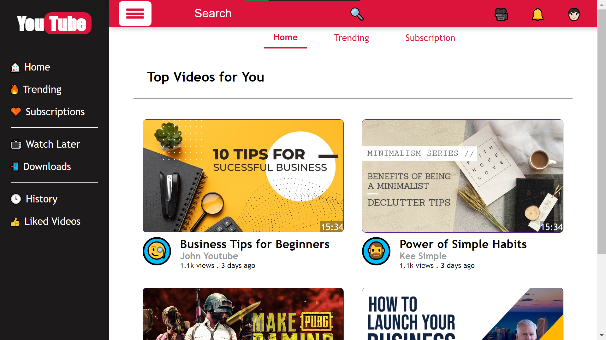
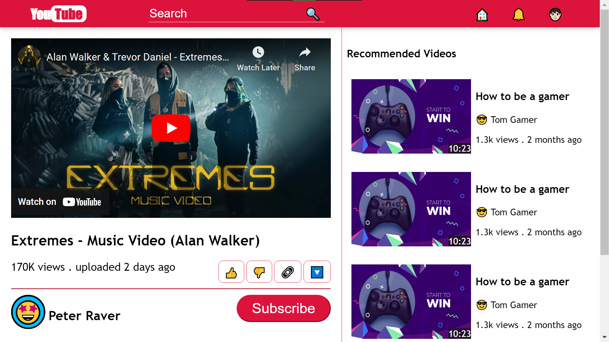

<!-- About the Project -->

## :star2: About the Project

This project is Youtube website clone with some changes in design.

 
  
  

<!-- Project Link -->

## :rocket: Project Webpage

### :computer: [Youtube Redesign](https://indiecodermm.github.io/modern-websites/youtube/index.html)

<!-- Features -->

## :dart: Features

- basic YouTube layout
- emoji icons
- embedded YouTube video player
- tabs with hamburger menu

<!-- Contact -->

## :handshake: Contact

IndieCoderMM - hthant00chk@gmail.com

Project Link: [https://github.com/IndieCoderMM/modern-websites/tree/master/youtube](https://github.com/IndieCoderMM/modern-websites/tree/master/youtube)
